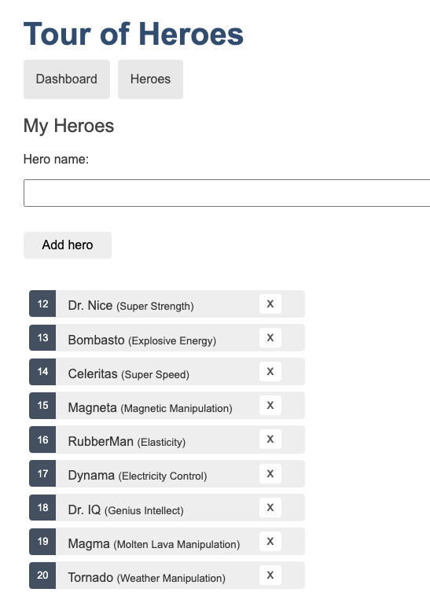

# Adding Super Powers to the Heroes

Let's use GitHub Copilot to add a to the Hero class, 
the goal is to have the following page in the end for the url `http://localhost:4200/heroes` : 




You can do it in 3 steps, or use a single ask to Copilot Chat.

<details>
<summary>Possible Flow</summary>

1. Open Copilot Chat
2. Ask the following question `@workspace I want to add a new field "superpower" to the Hero class, all heroes and show in in the list of heroes (heroes.component.html)`
3. Apply the change to the different files

</details>

## 001 - Adding the field to the class

Open the `src/app/hero.ts` file and use Copilot to add a new field to the Hero class:  superpower as string .

<details>
<summary>Possible Flow</summary>

1. Open `src/app/hero.ts`
2. Select the class code
3. Using Copilot Inline, ask the following question `add superpower field to the Hero class`.

The class shoud look like this:

```typescript
export interface Hero {
  id: number;
  name: string;
  superpower?: string; // Added superpower field as an optional string
}
```


</details>


## 002 - Adding the field to the list of heroes

Open the in memory data service `src/app/in-memory-data.service.ts` and use Copilot to add the field with values to the list of heroes.

<details>
<summary>Possible Flow</summary>

1. Open `src/app/in-memory-data.service.ts`
2. Select the list of heroes
3. Using Copilot Inline, ask the following question `add superpower to all heroes`.

The list of heroes should look like this:

```typescript
  createDb() {
    const heroes = [
      { id: 12, name: 'Dr. Nice', superpower: 'Super Strength' },
      { id: 13, name: 'Bombasto', superpower: 'Explosive Energy' },
      { id: 14, name: 'Celeritas', superpower: 'Super Speed' },
      { id: 15, name: 'Magneta', superpower: 'Magnetic Manipulation' },
      { id: 16, name: 'RubberMan', superpower: 'Elasticity' },
      { id: 17, name: 'Dynama', superpower: 'Electricity Control' },
      { id: 18, name: 'Dr. IQ', superpower: 'Genius Intellect' },
      { id: 19, name: 'Magma', superpower: 'Molten Lava Manipulation' },
      { id: 20, name: 'Tornado', superpower: 'Weather Manipulation' }
    ];
    return { heroes };
  }
```

</details>


## 003 - Show the superpower in the list of heroes

Open the `src/app/heroes/heroes.component.html` file and use Copilot to add the field to the list of heroes.

Optionally you can change the CSS to match the page showed above.

<details>
<summary>Possible Flow</summary>

1. Open `src/app/heroes/heroes.component.html`
2. Select the line with the hero name 
3. Using Copilot Inline, ask the following  `add superpower field in small between parenthesis`.

The list of heroes should look like this:

```html
<span class="badge">{{hero.id}}</span> {{hero.name}} <small>({{hero.superpower}})</small>
```

</details>